# Instalación y Configuración de React Native

Por [Dragón Nómada](https://dragonnomada.medium.com)

## Instalación de Android Studio

Vamos a utilizar Android Studio para tener disponible la compilación de nuestras aplicaciones en `Android`.

[https://developer.android.com/studio](https://developer.android.com/studio)

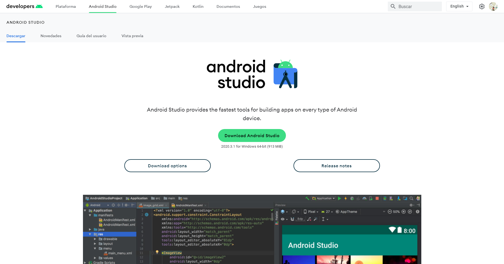

Descargamos Android Studio

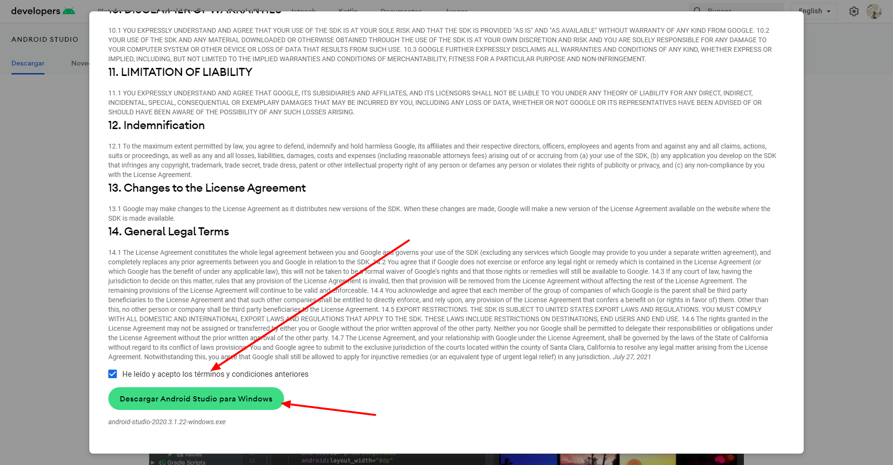

Abrir Android Studio.

**Nota:** Si tarda mucho abre el administrador de tareas y finaliza el proceso llamado `Android Studio`.

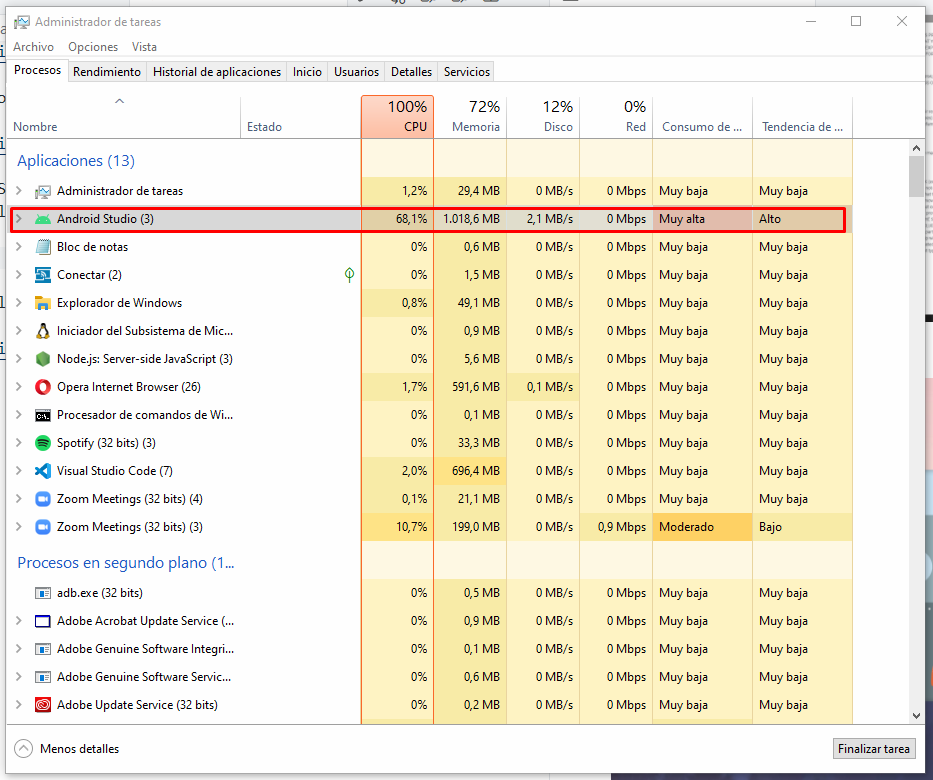

Al abrir el Android Studio debemos ir a `Tools/SDK Manager`.

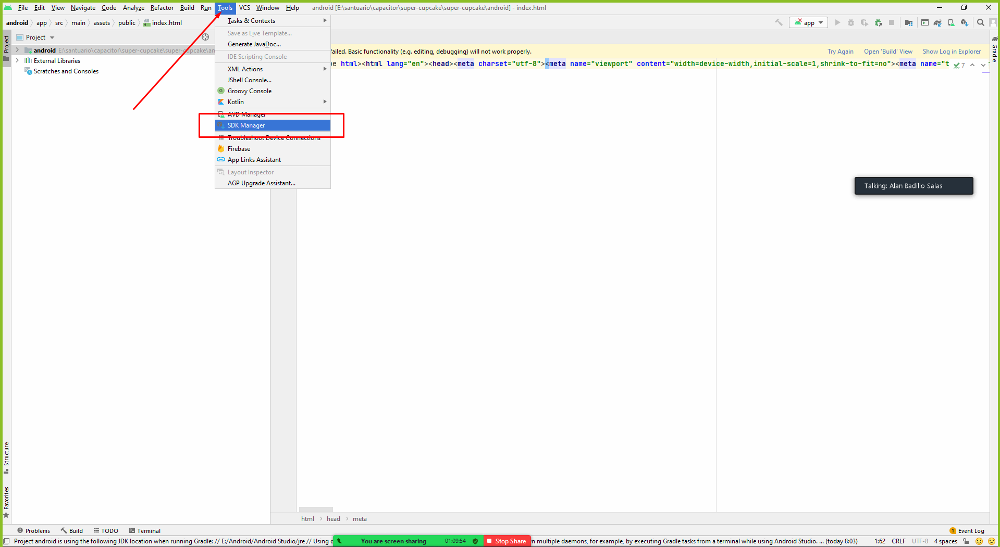

Vamos a editar la ruta del SDK Android.

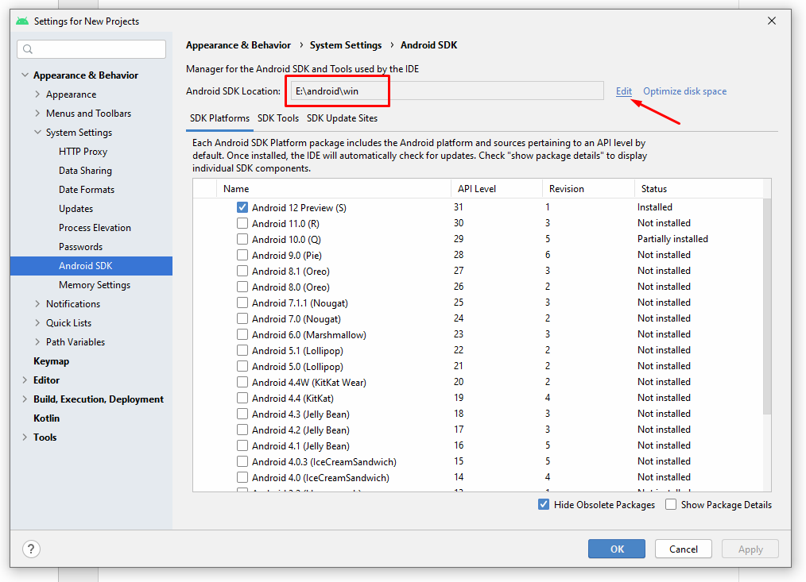

Y ubicamos una ruta fácil de ubicar.

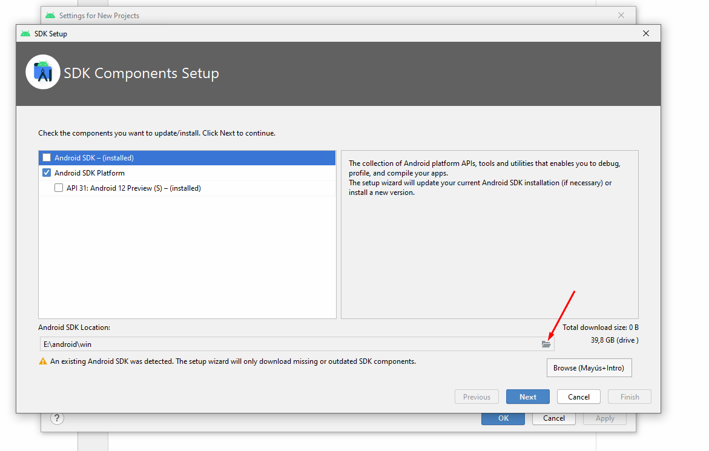

Abrir la `Configuración Avanzada del Sistema`

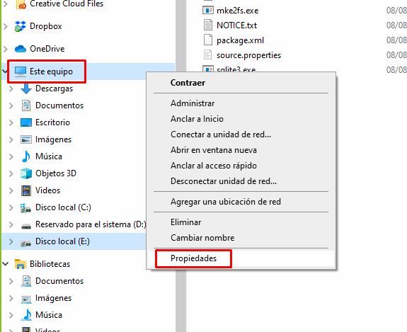

Dirigirse a las `Opciones Avanzadas del Sistema`.

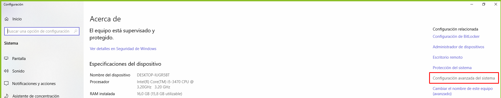

Abrir las `Variables de Entorno`

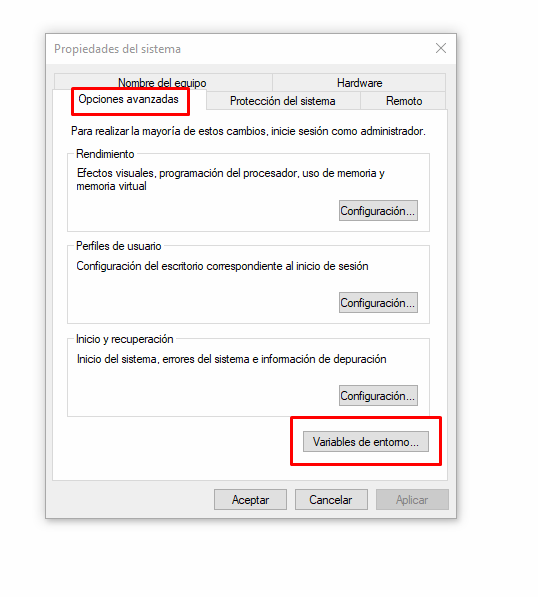

Agregar las variables para `ANDROID_HOME` y `ANDROID_SDK_ROOT` (si no existen).

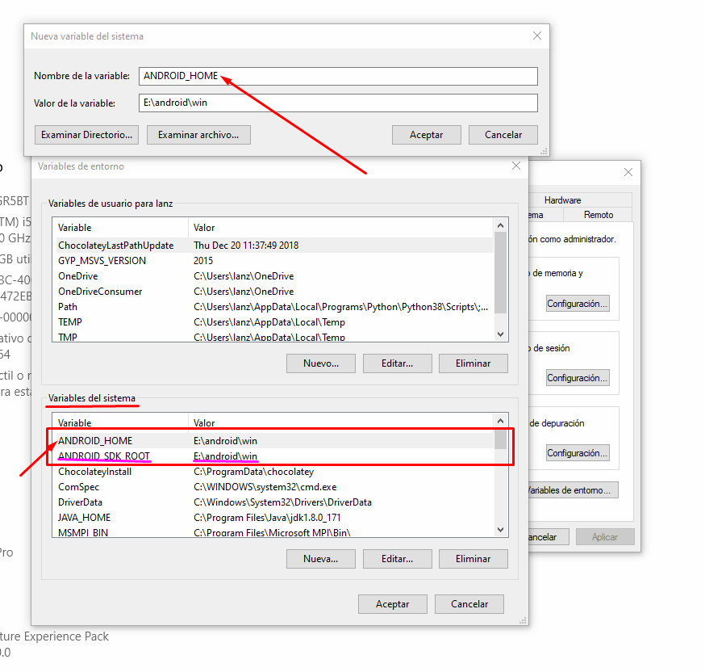

Agregar el `Path` hacia `platform-tools`.

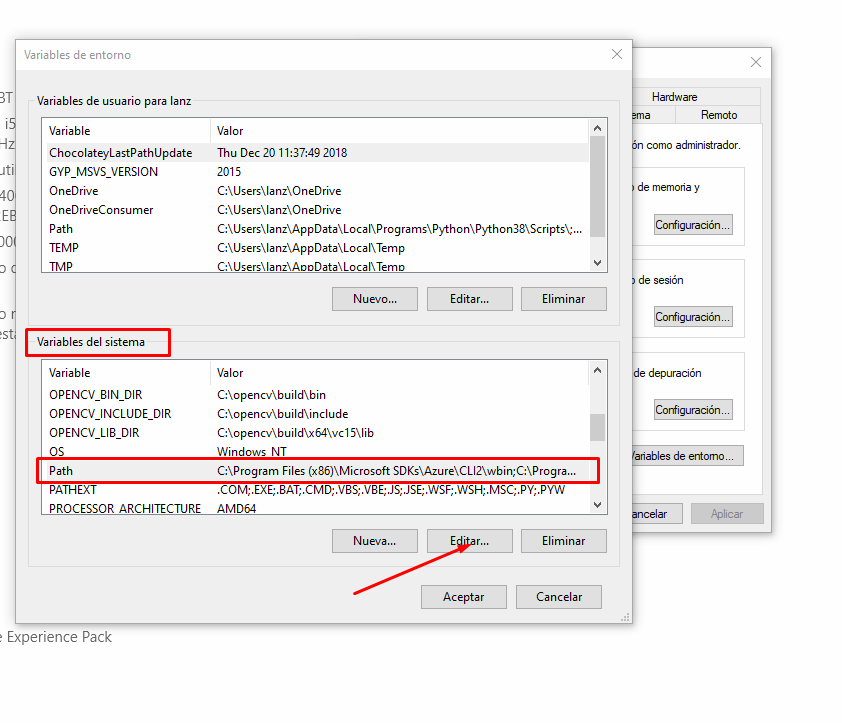

Debemos ubicar dentro de nuestro `SDK` a `platform-tools`.

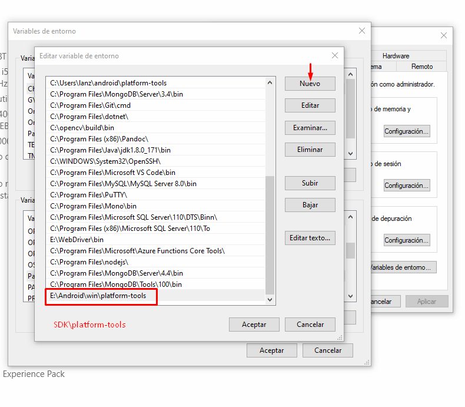

En un `Símbolo del sistema` podemos escribir `adb devices` para determinar si la instalación quedó correcta.

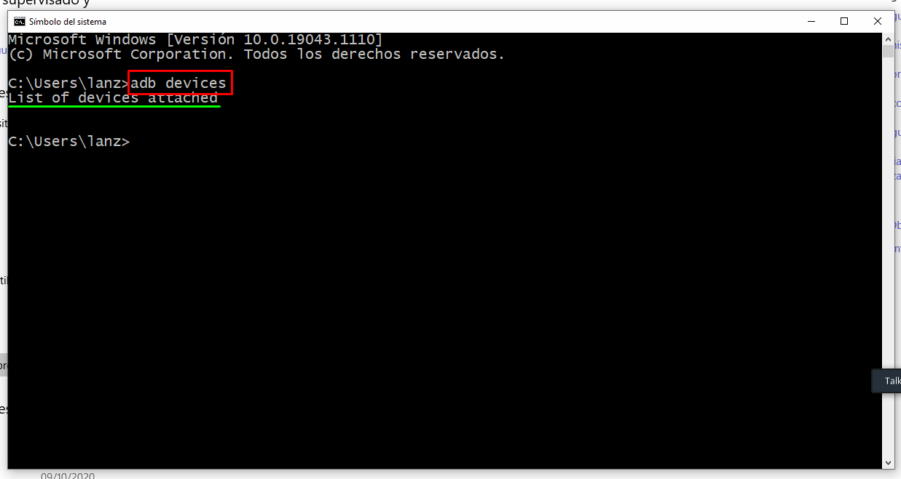

## Configurar un celular Android para Desarrollo

Ubicar la información del sistema en `Android`. Generalmente dice `Acerca de este teléfono`, `Sobre el teléfono` o `Acerca del disposivo o la vesión...`.

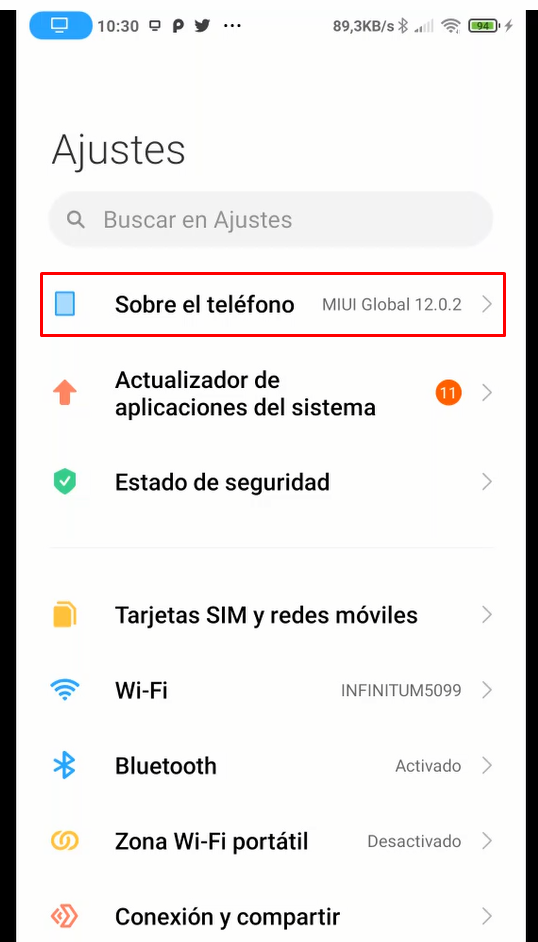

Pulsar 10 veces sobre la versión del sistema hasta activar las `Opciones de Desarrollador`.

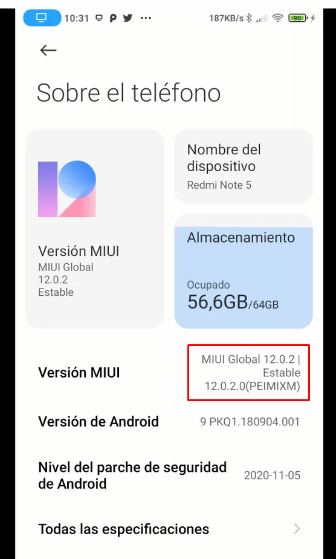

Confirmar que aparezca un mensaje de que ya se activaron.

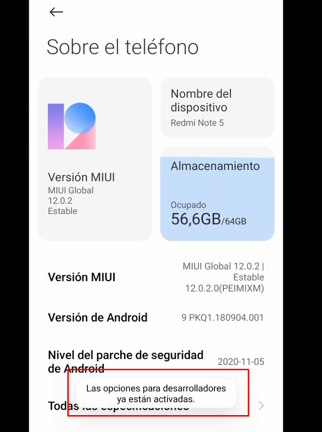

Buscar las opciones de desarrollador, generalmente en `Ajustes Adicionales` o `Acerca del teléfono`.

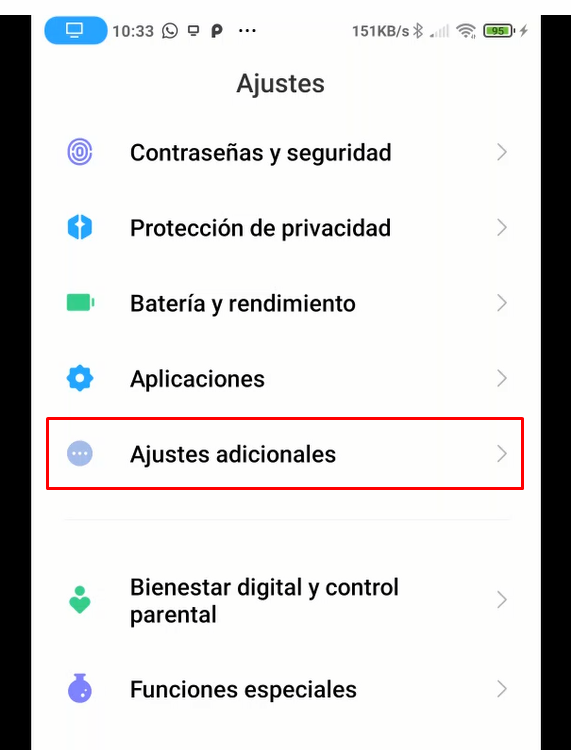

Abrir las opciones de desarrolador.

Activar la deputación por USB.

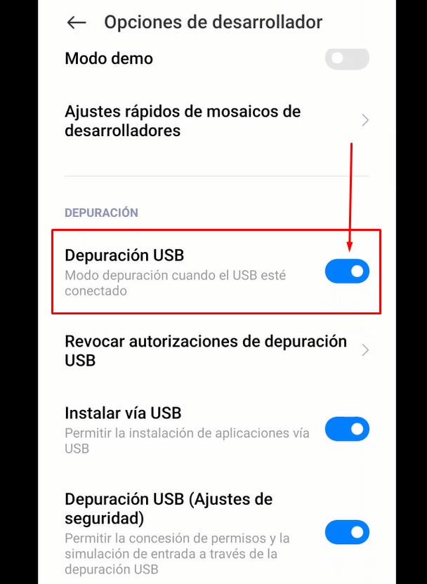

Comprobar que ahora se vea el dispositivo desde un símbolo del sistema.

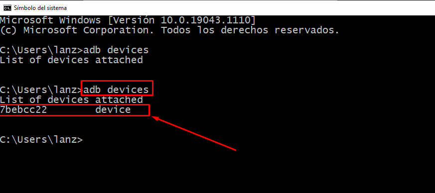
